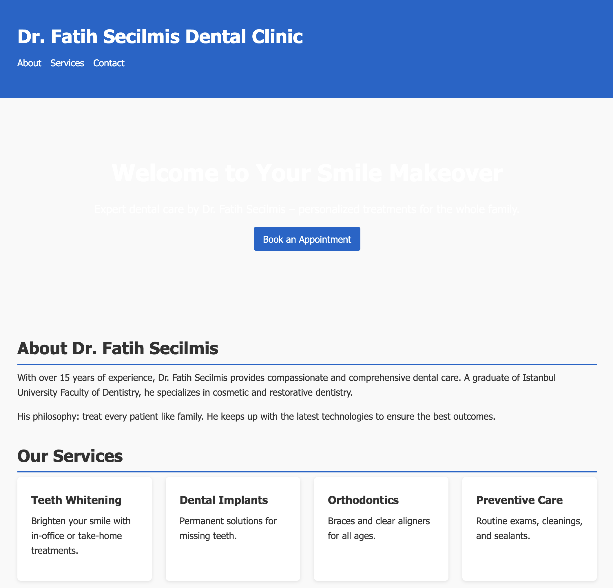
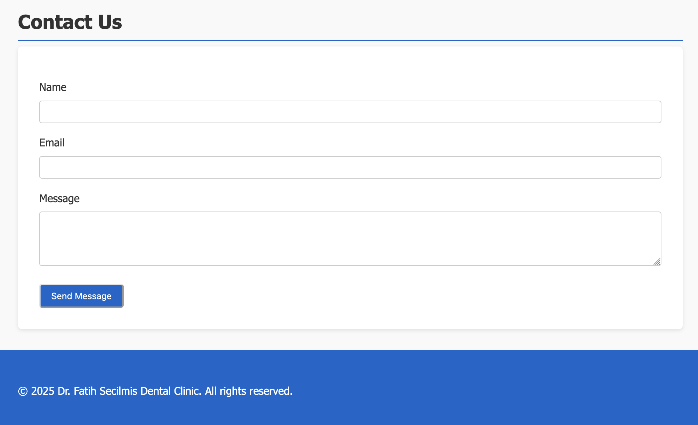

# Fatih Secilmis Dentist App

A simple, responsive React application for a dental clinic website.  
Built with Create React App, this project demonstrates component-based architecture and modern frontend practices.

## Table of Contents
1. [Screenshots](#screenshots)  
2. [Features](#features)  
3. [Technologies](#technologies)  
4. [Getting Started](#getting-started)  
5. [Project Structure](#project-structure)  
6. [Contributing](#contributing)  
7. [License](#license)  

## Screenshots

**Home / Hero Section**  


**Services Section**  


## Features

- Hero banner with background image and call-to-action  
- Services overview component  
- About section detailing the clinic’s mission  
- Contact form for appointment requests  
- Header with navigation links  
- Footer with social media links and contact information  
- Responsive design for mobile and desktop  

## Technologies

- React 18  
- React DOM  
- react-scripts (Create React App)  
- CSS  

## Getting Started

### Prerequisites

- Node.js (v14 or higher recommended)  
- npm (v6 or higher)  

### Installation

1. Clone the repository  
   ```bash
   git clone https://github.com/your-username/fatih-secilmis-dentist-app.git
   cd fatih-secilmis-dentist-app
   ```
2. Install dependencies  
   ```bash
   npm install
   ```
3. Run the development server  
   ```bash
   npm start
   ```
4. Open [http://localhost:3000](http://localhost:3000) in your browser.

### Build for Production

```bash
npm run build
```

## Project Structure

.
├── public/  
│   └── index.html           # HTML template  
├── screenshot1.png          # Hero section screenshot  
├── screenshot2.png          # Services section screenshot  
├── src/  
│   ├── assets/              # Images and static assets  
│   │   └── hero-dentist.jpg  
│   ├── components/          # Reusable UI components  
│   │   ├── About.js  
│   │   ├── Contact.js  
│   │   ├── Footer.js  
│   │   ├── Header.js  
│   │   ├── Hero.js  
│   │   └── Services.js  
│   ├── App.css              # Global styles  
│   ├── App.js               # Main app component  
│   ├── index.css            # Base CSS  
│   └── index.js             # React DOM render  
├── .gitignore  
├── package.json             # Project metadata \u0026 scripts  
└── README.md  

## Contributing

Contributions are welcome! Please open an issue or submit a pull request for bug fixes, enhancements, or new features.

## License

This project is released under the MIT License.  
